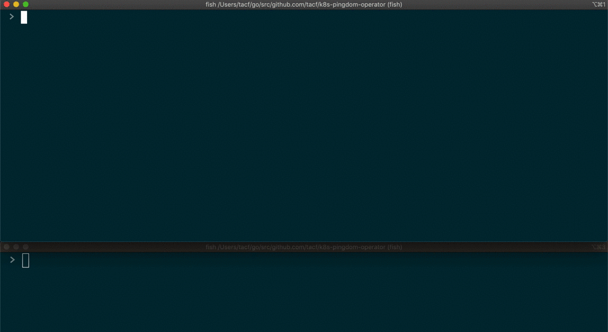
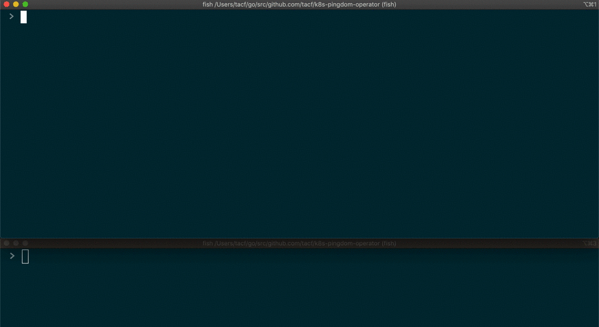

# K8s Pingdom Operator

K8s Pingdom Operator is a simple kubernates controller (based on the [operator pattern](https://kubernetes.io/docs/concepts/extend-kubernetes/operator/#operators-in-kubernetes)). It allows you to manage your _Pingdom_ service checks through the usage of [custom resources](https://kubernetes.io/docs/concepts/extend-kubernetes/api-extension/custom-resources/).

Since this was my first experince with K8s extensions (and Golang for production like purposes) this code is highly inspired by the [sample controller](https://github.com/kubernetes/sample-controller) from K8S oficial repo.

## Setup

Installing dependencies

```golang
go get -u
```

you may need to add `GO111MODULES=on` as a prefix for the command above, or simply export the variable.

## Building

In the root of the project just run

```golang
go build -o pingdom-controller .
```

## Running

Running it locally requires you to have you `kubeconfig` file properly setup so that the controller can easily communicate with the cluster api.

After setting the `kubeconfig` simply run

```shell
./pingdom-controller -kubeconfig=<path to kubeconfig>
```

When running it as a container in your cluster (as it is intedend to be ran) you should make sure that you container has enough permissions to access your control plane (through the use of a _service account_)

## Features

### Sync at controller startup


### Create and Delete Checks



### Update Checks



## Limitations

As of now the definition and implementation of the controller only allows for simple _http(s)_ checks to be created.
